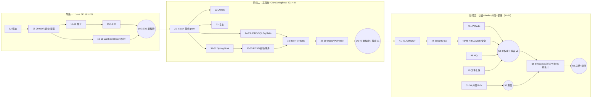

# Java 后端学习路线（面试向）

> 目标：通过 Java 后端岗位面试 + 能独立编写 Spring Boot REST API  
> 基础：非零基础，不系统  
> 节奏：每天 3-4 小时

## 配套文件

- [[learning-goal]] — 学习目标 / 验收标准
- [[progress]] — 章节进度（每章 5 个勾选项）
- [[review-plan]] — 间隔复习计划（+3 / +7 / +30）
- [[mistakes]] — 错题与易错点（强制写根因）
- [[glossary]] — 术语表，章节正文用双链引用
- [[interview-bank]] — 面试题库，按主题汇总各章 check 的高频题
- [[templates/chapter-template]] — 四件套统一模板

## 默认前置依赖

为避免每行表格再加一列，统一约定：

- **章节 NN 默认依赖 NN-1**（顺序学习）。
- **跨阶段依赖**：21（Maven 基线 pom）→ 后续所有 Spring 章；24-29（数据库+MyBatis）→ 36；31-32（Spring Boot）→ 33-45 全线；42（JWT）+ 44（Security）→ 50 里程碑；46-47（Redis）→ 50。
- **不依赖**：54（JVM）、56（Docker）、59（系统设计）可在第 40 章后任何时刻穿插。

## 章节列表

| # | 章节 | 核心内容 | 优先级 | 预计课时 | 状态 |
|---|---|---|---|---|---|
| 01 | 环境搭建与 Java 初印象 | JDK 21、IDEA、Maven、Git、首个 Java 程序 | L1 必须掌握 | 3小时 | ⬜ 未开始 |
| 02 | Java 基础语法 | 变量、基本类型、运算符、流程控制、输入输出 | L1 必须掌握 | 3小时 | ⬜ 未开始 |
| 03 | 方法与调试 | 方法、参数、返回值、重载、断点调试 | L1 必须掌握 | 3小时 | ⬜ 未开始 |
| 04 | 数组与字符串 | 数组、String、StringBuilder、常见字符串处理 | L1 必须掌握 | 3小时 | ⬜ 未开始 |
| 05 | 面向对象入门 | 类、对象、构造器、封装、this、static | L1 必须掌握 | 3小时 | ⬜ 未开始 |
| 06 | 继承与多态 | 继承、抽象类、接口、重写、向上转型 | L1 必须掌握 | 4小时 | ⬜ 未开始 |
| 07 | 包、访问控制与常用类 | package、访问修饰符、Math、Objects、Date/Time | L1 必须掌握 | 3小时 | ⬜ 未开始 |
| 08 | 异常处理 | checked/unchecked、try/catch/finally、自定义异常 | L1 必须掌握 | 3小时 | ⬜ 未开始 |
| 09 | 枚举与泛型入门 | enum、泛型类、泛型方法、类型边界 | L2 项目常用 | 3小时 | ⬜ 未开始 |
| 10 | 里程碑：Java SE 小项目 | 代码整理、README、Git 提交、基础测验 | L1 必须掌握 | 4小时 | ⬜ 未开始 |
| 11 | 集合框架上 | List、Set、Map、Iterator、集合选择 | L1 必须掌握 | 3小时 | ⬜ 未开始 |
| 12 | 集合框架下 | HashMap 原理、equals/hashCode、Comparable/Comparator | L3 面试高频 | 4小时 | ⬜ 未开始 |
| 13 | IO 基础 | File、InputStream、OutputStream、Reader/Writer | L1 必须掌握 | 3小时 | ⬜ 未开始 |
| 14 | NIO 与序列化 | Path、Files、Charset、JSON 序列化概念 | L2 项目常用 | 3小时 | ⬜ 未开始 |
| 15 | 阶段一总结测验 | Java SE 基础回顾、限时代码题、错题整理 | L1 必须掌握 | 3小时 | ⬜ 未开始 |
| 16 | Lambda 与函数式接口 | Lambda、函数式接口、方法引用、Predicate/Function | L1 必须掌握 | 3小时 | ⬜ 未开始 |
| 17 | Stream API | map/filter/reduce/collect/groupingBy、流式聚合 | L1 必须掌握 | 4小时 | ⬜ 未开始 |
| 18 | Optional 与时间 API | Optional、LocalDateTime、Duration、格式化 | L2 项目常用 | 3小时 | ⬜ 未开始 |
| 19 | 注解与反射 | Annotation、Class、Field、Method、运行时元数据 | L3 面试高频 | 4小时 | ⬜ 未开始 |
| 20 | 里程碑：Java 工具库 | 集合、IO、Stream、泛型、反射综合 | L1 必须掌握 | 4小时 | ⬜ 未开始 |
| 21 | Maven 工程化 | pom、依赖、生命周期、插件、多模块概念 | L1 必须掌握 | 3小时 | ⬜ 未开始 |
| 22 | 单元测试 | JUnit 5、断言、参数化测试、测试命名 | L1 必须掌握 | 3小时 | ⬜ 未开始 |
| 23 | 日志体系 | SLF4J、Logback、日志级别、日志格式 | L2 项目常用 | 3小时 | ⬜ 未开始 |
| 24 | JDBC 入门 | Driver、Connection、PreparedStatement、连接释放 | L1 必须掌握 | 4小时 | ⬜ 未开始 |
| 25 | SQL 基础 | 表设计、CRUD、约束、索引入门 | L1 必须掌握 | 3小时 | ⬜ 未开始 |
| 26 | SQL 进阶 | JOIN、聚合、分页、事务、执行计划入门 | L3 面试高频 | 4小时 | ⬜ 未开始 |
| 27 | 数据库建模 | 一对多、多对多、ER 图、范式、字段设计 | L2 项目常用 | 3小时 | ⬜ 未开始 |
| 28 | MyBatis 入门 | Mapper、XML/注解、动态 SQL、结果映射 | L1 必须掌握 | 4小时 | ⬜ 未开始 |
| 29 | MyBatis 进阶 | 分页、事务、N+1、批量操作、SQL 日志 | L3 面试高频 | 4小时 | ⬜ 未开始 |
| 30 | 里程碑：博客 DAO 层 | JDBC/MyBatis/SQL 整合、README、测试 | L1 必须掌握 | 4小时 | ⬜ 未开始 |
| 31 | Spring 基础 | IoC、DI、Bean、配置方式、生命周期 | L1 必须掌握 | 4小时 | ⬜ 未开始 |
| 32 | Spring Boot 入门 | Starter、自动配置、Controller、Service | L1 必须掌握 | 4小时 | ⬜ 未开始 |
| 33 | REST API 设计 | 资源命名、状态码、DTO、统一响应、版本化 | L3 面试高频 | 3小时 | ⬜ 未开始 |
| 34 | 参数校验与异常处理 | Validation、全局异常处理、错误码设计 | L1 必须掌握 | 4小时 | ⬜ 未开始 |
| 35 | 分层架构与事务 | Controller/Service/Repository、事务边界、业务异常 | L1 必须掌握 | 4小时 | ⬜ 未开始 |
| 36 | Spring Boot + MyBatis | 数据源、Mapper 扫描、分页、事务整合 | L1 必须掌握 | 4小时 | ⬜ 未开始 |
| 37 | Spring Data JPA 可选线 | Entity、Repository、关联映射、MyBatis/JPA 对比 | L2 项目常用 | 3小时 | ⬜ 未开始 |
| 38 | OpenAPI 文档 | springdoc、接口分组、请求示例、调试 | L2 项目常用 | 3小时 | ⬜ 未开始 |
| 39 | 配置与环境 | profile、配置注入、敏感信息、环境隔离 | L2 项目常用 | 3小时 | ⬜ 未开始 |
| 40 | 里程碑：博客 API v1 | Spring Boot + DB + 文档 + 测试 + GitHub | L1 必须掌握 | 4小时 | ⬜ 未开始 |
| 41 | 认证基础 | Session、JWT、密码哈希、登录流程设计 | L3 面试高频 | 3小时 | ⬜ 未开始 |
| 42 | JWT 实战 | Access Token、Refresh Token、拦截器、续签 | L1 必须掌握 | 4小时 | ⬜ 未开始 |
| 43 | 权限控制 | RBAC、角色、权限、资源鉴权、管理员接口 | L2 项目常用 | 4小时 | ⬜ 未开始 |
| 44 | Spring Security 入门 | Filter Chain、Authentication、Authorization | L1 必须掌握 | 4小时 | ⬜ 未开始 |
| 45 | Web 安全防护 | XSS、CSRF、SQL 注入、限流、敏感信息保护 | L3 面试高频 | 3小时 | ⬜ 未开始 |
| 46 | Redis 基础与缓存 | 数据结构、过期时间、Cache-Aside、缓存命名 | L1 必须掌握 | 4小时 | ⬜ 未开始 |
| 47 | Redis 进阶 | 缓存穿透/击穿/雪崩、分布式锁、排行榜 | L3 面试高频 | 4小时 | ⬜ 未开始 |
| 48 | 消息队列概念 | 异步任务、重试、死信、RabbitMQ/Kafka 对比 | L2 项目常用 | 3小时 | ⬜ 未开始 |
| 49 | 文件上传 | Multipart、文件校验、对象存储概念、访问 URL | L2 项目常用 | 3小时 | ⬜ 未开始 |
| 50 | 里程碑：博客 API v2 | 认证、权限、缓存、安全、文件上传整合 | L1 必须掌握 | 4小时 | ⬜ 未开始 |
| 51 | 并发基础 | Thread、Runnable、Callable、线程状态、join | L3 面试高频 | 4小时 | ⬜ 未开始 |
| 52 | 线程池与异步 | Executor、ThreadPoolExecutor、CompletableFuture | L3 面试高频 | 4小时 | ⬜ 未开始 |
| 53 | 并发安全 | synchronized、Lock、Atomic、volatile、可见性 | L3 面试高频 | 4小时 | ⬜ 未开始 |
| 54 | JVM 基础 | 内存区域、类加载、GC 概念、常见参数 | L3 面试高频 | 4小时 | ⬜ 未开始 |
| 55 | 里程碑：并发 + JVM 测验 | 高频面试题、代码实验、错题复盘 | L1 必须掌握 | 4小时 | ⬜ 未开始 |
| 56 | Docker 部署 | Dockerfile、Compose、MySQL/Redis 编排、健康检查 | L2 项目常用 | 4小时 | ⬜ 未开始 |
| 57 | 测试策略 | 单元测试、集成测试、MockMvc、测试数据 | L2 项目常用 | 4小时 | ⬜ 未开始 |
| 58 | 性能优化 | SQL 索引、慢查询、接口压测、日志排查 | L3 面试高频 | 4小时 | ⬜ 未开始 |
| 59 | 系统设计与面试 | 限流、缓存、排行榜、短链、登录系统设计 | L3 面试高频 | 4小时 | ⬜ 未开始 |
| 60 | 总结与进阶路线 | 项目包装、简历描述、JDK 25 新特性、后续路线 | L1 必须掌握 | 3小时 | ⬜ 未开始 |

## 优先级说明

- **L1 必须掌握**：面试 + 项目都要，不能跳过
- **L2 项目常用**：工作中经常用，建议掌握
- **L3 面试高频**：面试容易问，要重点准备
- **L4 进阶拓展**：有余力时学，可暂缓

## 知识图谱

## 起步建议

1. 先把 `[[chapters/21-Maven工程化/02-demo|21 章基线 pom]]` 跑通——这是后续所有 demo 的依赖底座。
2. 学每章 `01-theory` 前，先看 `04-project-task` 的「任务目标」，带着问题读理论。
3. 学完每章把不会的题摘到 `[[mistakes]]`，按 `[[review-plan]]` 节奏复习。
